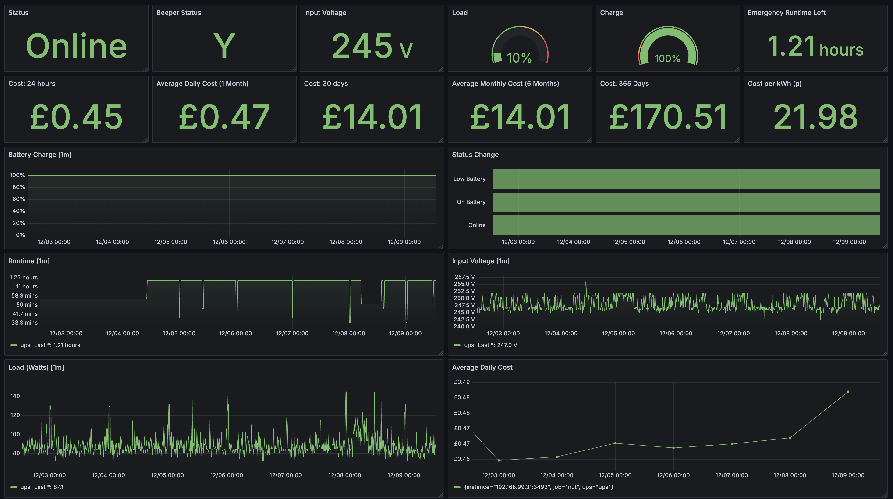

## UPS Grafana Dashboard for NUT Servers

Heavily inspired from [HON95/prometheus-nut-exporter](https://github.com/HON95/prometheus-nut-exporter), with some minor additions/changes

* ✅ Battery charge charts
* ✅ UPS status support
* ✅ Load and input voltage monitoring
* ✅ Indication of battery runtime remaining
* ✅ Energy cost analysis over a day / a month / a year (_NEW_)

Please enjoy, and share your contributions.

## Getting Started

### Set up the NUT exporter & Prometheus

Follow the instructions laid out in the [HON95 prometheus-nut-exporter](https://github.com/HON95/prometheus-nut-exporter).

### Set up the dashboard

1) Edit the JSON model and replace `REPLACE_WITH_YOUR_INSTANCE_VALUE` with your instance variable.
2) Import the JSON model - [grafana.com instructions](https://grafana.com/docs/grafana/latest/dashboards/build-dashboards/import-dashboards/)
3) Edit the Status Change panel and choose the overrides that fit your instance and NUT status outputs, if it doesn't look right. 
4) At the top of the dashboard, set your cost of energy (kWh)

Otherwise, it should be good to go!

<!-- CONTACT -->
## Contact

Will Lewis - [Matrix](https://matrix.to/#/@me:wi11.co.uk) -  [Bluesky](https://bsky.app/profile/wlewis.bsky.social) - [Web](https://willlewis.co.uk)
